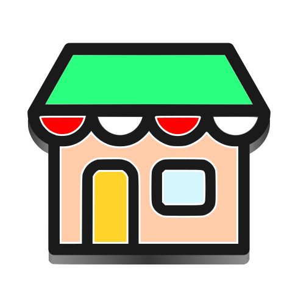

# Boutique
A Fast and Convenient Flatpak frontend

  

  

A Work-in-Progress Flatpak and Appimages app manager made with GTK4.

## Testing

(please keep in mind this is alpha software)

1. Open GNOME Builder
2. Press the "Clone Repository" button in the bottom of window
3. Paste this in "Repository URL" `https://github.com/mijorus/boutique.git`
4. Press the "Build" button (hammer in the header bar)
5. Press on the status panel and click "Export Bundle" to export the app as a Flatpak bundle
6. Install the bundle with `flatpak install <path to bundle>`
